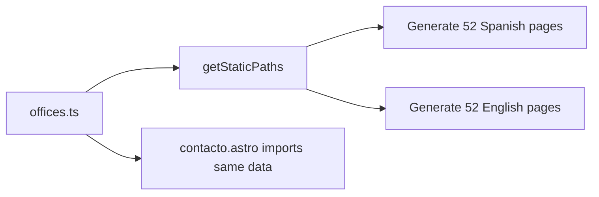

# Design Document: Location Pages

## Overview

Create individual landing pages for each of VivaSpeak's 52 office locations across Spain. Each page will live at `/ubicaciones/{city-slug}/` (Spanish) and `/en/locations/{city-slug}/` (English), generated dynamically from a shared data source using Astro's dynamic routing (`[...slug].astro` or `[city].astro`). Pages will feature unique localized content, local SEO optimization, office details, and conversion CTAs.

## Architecture

### Dynamic Route Generation

Astro's file-based routing with `getStaticPaths()` will generate all 52 pages at build time from a single template file per language.

```
src/
├── data/
│   └── offices.ts              # Shared office data (extracted from contacto.astro)
├── pages/
│   ├── ubicaciones/
│   │   └── [city].astro        # Spanish location page template
│   └── en/
│       └── locations/
│           └── [city].astro    # English location page template
```

### Data Flow



## Components and Interfaces

### Shared Data Module: `src/data/offices.ts`

Extract the offices array from `contacto.astro` into a shared module. Each office object will be extended with additional fields needed for the location pages.

```typescript
export interface Office {
  province: string;
  city: string;
  coworking: string;
  address: string;
  zip: string;
  slug: string; // URL-safe city slug (e.g., "vitoria-gasteiz")
  // Localized content for Spanish pages
  description: string; // 2-3 sentence intro about VivaSpeak in this city
  whyLocal: string; // Why VivaSpeak is relevant in this area
  industries: string[]; // Key local industries that benefit from VivaSpeak
  // Localized content for English pages
  descriptionEn: string;
  whyLocalEn: string;
  industriesEn: string[];
}

export const offices: Office[] = [
  {
    province: 'Madrid',
    city: 'Madrid',
    coworking: 'The Shed Coworking',
    address: 'Calle de Hermosilla, 48',
    zip: '28001',
    slug: 'madrid',
    description: 'En Madrid, VivaSpeak ayuda a empresas a automatizar...',
    whyLocal: 'Como centro de negocios de España...',
    industries: ['Clínicas', 'Inmobiliarias', 'Despachos de abogados'],
    descriptionEn: 'In Madrid, VivaSpeak helps businesses automate...',
    whyLocalEn: "As Spain's business hub...",
    industriesEn: ['Clinics', 'Real estate', 'Law firms'],
  },
  // ... 51 more offices
];
```

### Location Page Template: `src/pages/ubicaciones/[city].astro`

Uses `getStaticPaths()` to generate all pages. The template structure:

```
┌─────────────────────────────────────────┐
│  LandingHeader                          │
├─────────────────────────────────────────┤
│  Hero Section                           │
│  - Eyebrow: "VivaSpeak en {Province}"   │
│  - H1: "Agente de Voz IA en {City}"     │
│  - Localized description paragraph      │
│  - Primary CTA: "Solicitar demo"        │
├─────────────────────────────────────────┤
│  Services Section                       │
│  - What VivaSpeak does (3-4 cards)      │
│  - Calls, WhatsApp, CRM, Scheduling    │
├─────────────────────────────────────────┤
│  Why VivaSpeak in {City} Section        │
│  - Localized relevance text             │
│  - Key local industries list            │
├─────────────────────────────────────────┤
│  Office Details Section                 │
│  - Coworking name, address, zip         │
│  - Phone, WhatsApp, Email links         │
│  - Google Maps embed                    │
├─────────────────────────────────────────┤
│  FAQ Section                            │
│  - 4-5 general VivaSpeak FAQs           │
│  - Reused from homepage schema          │
├─────────────────────────────────────────┤
│  CTA Section                            │
│  - "Empieza hoy en {City}"             │
│  - Demo button + WhatsApp link          │
├─────────────────────────────────────────┤
│  Footer                                 │
└─────────────────────────────────────────┘
```

### English Location Page Template: `src/pages/en/locations/[city].astro`

Same structure as the Spanish version but using `LandingHeaderEn`, `FooterEn`, and English content fields from the data.

### Updated `contacto.astro`

- Import offices from `src/data/offices.ts` instead of defining inline
- Add a link on each office card to `/ubicaciones/{slug}/`

## Data Models

### Office Data (`src/data/offices.ts`)

The single source of truth for all office data. The `slug` field is derived from the city name using a helper function:

```typescript
function toSlug(city: string): string {
  return city
    .toLowerCase()
    .normalize('NFD')
    .replace(/[\u0300-\u036f]/g, '') // Remove diacritics
    .replace(/\s+/g, '-')
    .replace(/[^a-z0-9-]/g, '');
}
```

### SEO Metadata Per Page

Each page generates its own metadata from the office data:

| Field       | Spanish                                                                                                               | English                                                                                                         |
| ----------- | --------------------------------------------------------------------------------------------------------------------- | --------------------------------------------------------------------------------------------------------------- |
| Title       | `Agente de Voz IA en {City} \| VivaSpeak`                                                                             | `AI Voice Agent in {City} \| VivaSpeak`                                                                         |
| Description | `VivaSpeak en {City}: automatiza llamadas, WhatsApp y atención al cliente con IA. Oficina en {Coworking}, {Address}.` | `VivaSpeak in {City}: automate calls, WhatsApp and customer service with AI. Office at {Coworking}, {Address}.` |
| Canonical   | `https://vivaspeak.com/ubicaciones/{slug}/`                                                                           | `https://vivaspeak.com/en/locations/{slug}/`                                                                    |
| alternateEs | `https://vivaspeak.com/ubicaciones/{slug}/`                                                                           | `https://vivaspeak.com/ubicaciones/{slug}/`                                                                     |
| alternateEn | `https://vivaspeak.com/en/locations/{slug}/`                                                                          | `https://vivaspeak.com/en/locations/{slug}/`                                                                    |

### Structured Data (JSON-LD)

Each location page will include:

1. **LocalBusiness schema** (new, not currently in SchemaMarkup component — will be added inline in the page template):

```json
{
  "@context": "https://schema.org",
  "@type": "LocalBusiness",
  "name": "VivaSpeak - {City}",
  "address": {
    "@type": "PostalAddress",
    "streetAddress": "{Address}",
    "addressLocality": "{City}",
    "postalCode": "{Zip}",
    "addressCountry": "ES"
  },
  "telephone": "+34951798932",
  "url": "https://vivaspeak.com/ubicaciones/{slug}/"
}
```

2. **BreadcrumbList** (using existing SchemaMarkup component):

```json
[
  { "name": "Inicio", "url": "https://vivaspeak.com/" },
  { "name": "Ubicaciones", "url": "https://vivaspeak.com/contacto/" },
  { "name": "{City}", "url": "https://vivaspeak.com/ubicaciones/{slug}/" }
]
```

3. **FAQPage** (using existing SchemaMarkup component with shared FAQ data).

## Error Handling

- If a user navigates to `/ubicaciones/nonexistent-city/`, Astro's static generation will naturally result in a 404 since the page won't be generated. No custom error handling needed beyond Astro's default 404 behavior.
- Offices with `[Coworking por confirmar]` or `[Dirección por confirmar]` will still get pages generated but the map embed will fall back to showing the city center (this behavior already exists in `contacto.astro`).

## Testing Strategy

### Unit/Build Tests

- Verify that `offices.ts` exports the correct number of offices (52)
- Verify all offices have valid slugs (no duplicates, no empty strings)
- Verify all offices have non-empty `description`, `whyLocal`, `industries` fields for both languages

### Integration Tests

- Build the site and verify 52 Spanish + 52 English location pages are generated
- Verify each generated page contains the correct city name in the `<title>` tag
- Verify each generated page contains LocalBusiness JSON-LD
- Verify `contacto.astro` links point to valid location page URLs

### Manual Verification

- Spot-check a few location pages for correct content rendering
- Verify Google Maps embeds load correctly
- Verify mobile responsiveness
- Validate structured data with Google's Rich Results Test
