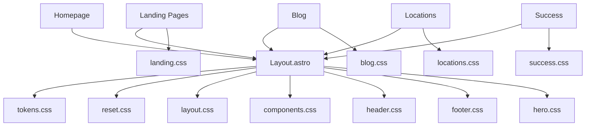

# Design Document — VivaSpeak UI Redesign

## Overview

This redesign transforms the VivaSpeak website from its current style (heavy gradients, complex animations, inconsistent component patterns across pages) into a modern, minimalistic SaaS aesthetic. The approach is mobile-first, token-driven, and component-based. Brand colors and logos are preserved. The existing Astro architecture, bilingual routing, schema markup, and Netlify form integration remain untouched.

### Key Design Principles

- Mobile-first: base styles target small screens; `min-width` queries add complexity
- Minimalistic: generous whitespace, flat surfaces, subtle depth via shadows
- Consistent: one card style, one section pattern, one button system across all pages
- Performant: fewer CSS rules, no heavy animations, optional lighter icon approach

---

## Architecture

### CSS File Structure (Refactored)

```
styles/
├── tokens.css          # Design tokens (colors, typography, spacing, shadows, radii)
├── reset.css           # Minimal CSS reset + base element styles
├── layout.css          # Container, section, grid, flex utilities
├── components.css      # Shared components: buttons, cards, badges, accordion, forms
├── header.css          # Header + mobile nav (refactored)
├── footer.css          # Footer (new file, extracted from global.css)
├── hero.css            # Hero section pattern (shared across all pages)
├── blog.css            # Blog index + article styles (refactored)
├── locations.css       # Location index + detail pages (merged ubicaciones + locations-index)
├── landing.css         # Shared landing page overrides (replaces real-estate, recruiting, abogados, servicios-operativos, landing-header)
├── success.css         # Success page (simplified)
└── global.css          # Imports all above files; minimal glue code
```

Files removed/merged:

- `real-estate.css`, `recruiting.css`, `abogados.css`, `servicios-operativos.css` → merged into `landing.css` (shared patterns) + page-level `<style>` blocks for truly unique overrides
- `landing-header.css` → merged into `header.css` (one header system)
- `ubicaciones.css` + `locations-index.css` → merged into `locations.css`
- `resources.css` → merged into `blog.css`

### Import Order in global.css

```css
@import './tokens.css';
@import './reset.css';
@import './layout.css';
@import './components.css';
@import './header.css';
@import './footer.css';
@import './hero.css';
```

Page-specific CSS files are imported only in the pages/components that need them (Astro scoped imports).

---

## Components and Interfaces

### 1. Design Tokens (`tokens.css`)

```css
:root {
  /* Brand colors — preserved */
  --primary: #1abc9c;
  --primary-dark: #16a085;
  --primary-darker: #0e6655;
  --cta: #ff6600;
  --cta-hover: #e65c00;

  /* Neutrals */
  --gray-50: #f9fafb;
  --gray-100: #f3f4f6;
  --gray-200: #e5e7eb;
  --gray-300: #d1d5db;
  --gray-400: #9ca3af;
  --gray-500: #6b7280;
  --gray-600: #4b5563;
  --gray-700: #374151;
  --gray-800: #1f2937;
  --gray-900: #111827;

  /* Semantic */
  --color-text: #1f2937; /* gray-800 */
  --color-text-muted: #6b7280; /* gray-500 */
  --color-bg: #ffffff;
  --color-bg-subtle: #f9fafb; /* gray-50 */
  --color-bg-muted: #f3f4f6; /* gray-100 */
  --color-border: #e5e7eb; /* gray-200 */

  /* Typography */
  --font-sans: 'Inter', system-ui, -apple-system, sans-serif;
  --font-mono: 'JetBrains Mono', monospace;

  --text-xs: 0.75rem; /* 12px */
  --text-sm: 0.875rem; /* 14px */
  --text-base: 1rem; /* 16px */
  --text-lg: 1.125rem; /* 18px */
  --text-xl: 1.25rem; /* 20px */
  --text-2xl: 1.5rem; /* 24px */
  --text-3xl: 2rem; /* 32px */
  --text-4xl: 2.5rem; /* 40px */
  --text-5xl: 3rem; /* 48px */

  --leading-tight: 1.15;
  --leading-normal: 1.5;
  --leading-relaxed: 1.7;

  --font-normal: 400;
  --font-medium: 500;
  --font-semibold: 600;
  --font-bold: 700;
  --font-extrabold: 800;

  /* Spacing */
  --space-1: 4px;
  --space-2: 8px;
  --space-3: 12px;
  --space-4: 16px;
  --space-5: 20px;
  --space-6: 24px;
  --space-8: 32px;
  --space-10: 40px;
  --space-12: 48px;
  --space-16: 64px;
  --space-20: 80px;
  --space-24: 96px;

  /* Border radius */
  --radius-sm: 6px;
  --radius-md: 10px;
  --radius-lg: 16px;
  --radius-xl: 24px;
  --radius-full: 9999px;

  /* Shadows */
  --shadow-xs: 0 1px 2px rgba(0, 0, 0, 0.05);
  --shadow-sm: 0 1px 3px rgba(0, 0, 0, 0.1), 0 1px 2px rgba(0, 0, 0, 0.06);
  --shadow-md: 0 4px 6px rgba(0, 0, 0, 0.07), 0 2px 4px rgba(0, 0, 0, 0.06);
  --shadow-lg: 0 10px 15px rgba(0, 0, 0, 0.1), 0 4px 6px rgba(0, 0, 0, 0.05);
  --shadow-xl: 0 20px 25px rgba(0, 0, 0, 0.1), 0 10px 10px rgba(0, 0, 0, 0.04);

  /* Focus */
  --ring-color: rgba(26, 188, 156, 0.4);
  --ring: 0 0 0 3px var(--ring-color);

  /* Transitions */
  --transition-fast: 150ms ease;
  --transition-base: 200ms ease;
  --transition-slow: 300ms ease-out;
}
```

### 2. Reset & Base (`reset.css`)

Minimal reset:

- `box-sizing: border-box` on all elements
- Remove default margins on body, headings, paragraphs
- `font-family: var(--font-sans)` on body
- `color: var(--color-text)` on body
- `background: var(--color-bg)` on body
- Smooth scroll on `html`
- `font-display: swap` for Inter (loaded via `<link>` in Layout)
- Skip-link styles preserved
- `prefers-reduced-motion` media query to disable transitions/animations

### 3. Layout Utilities (`layout.css`)

```css
.container {
  width: 100%;
  max-width: 1120px;
  margin: 0 auto;
  padding: 0 var(--space-4); /* 16px mobile */
}

@media (min-width: 768px) {
  .container {
    padding: 0 var(--space-6);
  }
}

.section {
  padding: var(--space-16) 0; /* 64px vertical */
}

@media (min-width: 768px) {
  .section {
    padding: var(--space-20) 0;
  } /* 80px */
}

@media (min-width: 1024px) {
  .section {
    padding: var(--space-24) 0;
  } /* 96px */
}

.grid {
  display: grid;
  gap: var(--space-6);
}

.grid-2 {
  grid-template-columns: 1fr;
}
.grid-3 {
  grid-template-columns: 1fr;
}
.grid-4 {
  grid-template-columns: 1fr;
}

@media (min-width: 640px) {
  .grid-2 {
    grid-template-columns: repeat(2, 1fr);
  }
  .grid-4 {
    grid-template-columns: repeat(2, 1fr);
  }
}

@media (min-width: 768px) {
  .grid-3 {
    grid-template-columns: repeat(2, 1fr);
  }
}

@media (min-width: 1024px) {
  .grid-3 {
    grid-template-columns: repeat(3, 1fr);
  }
  .grid-4 {
    grid-template-columns: repeat(4, 1fr);
  }
}
```

### 4. Buttons (`components.css`)

Two button variants + ghost:

```css
.btn {
  display: inline-flex;
  align-items: center;
  justify-content: center;
  gap: var(--space-2);
  padding: var(--space-3) var(--space-6);
  font-size: var(--text-base);
  font-weight: var(--font-semibold);
  border-radius: var(--radius-md);
  text-decoration: none;
  cursor: pointer;
  border: 2px solid transparent;
  transition: all var(--transition-base);
  min-height: 44px; /* touch target */
}

.btn-primary {
  background: var(--cta);
  color: #fff;
}
.btn-primary:hover {
  background: var(--cta-hover);
}

.btn-secondary {
  background: transparent;
  border-color: var(--cta);
  color: var(--cta);
}
.btn-secondary:hover {
  background: var(--cta);
  color: #fff;
}

.btn-ghost {
  background: transparent;
  color: var(--color-text);
  border-color: var(--color-border);
}
.btn-ghost:hover {
  border-color: var(--gray-400);
}

.btn:focus-visible {
  outline: none;
  box-shadow: var(--ring);
}
```

### 5. Card Component (`components.css`)

One unified card:

```css
.card {
  background: var(--color-bg);
  border: 1px solid var(--color-border);
  border-radius: var(--radius-lg);
  padding: var(--space-6);
  transition: box-shadow var(--transition-base);
}

.card:hover {
  box-shadow: var(--shadow-md);
}

.card-icon {
  width: 48px;
  height: 48px;
  display: flex;
  align-items: center;
  justify-content: center;
  border-radius: var(--radius-md);
  background: rgba(26, 188, 156, 0.1);
  color: var(--primary-dark);
  font-size: var(--text-xl);
  margin-bottom: var(--space-4);
}

.card h3 {
  font-size: var(--text-lg);
  font-weight: var(--font-semibold);
  margin: 0 0 var(--space-2);
  color: var(--gray-900);
}

.card p {
  font-size: var(--text-base);
  color: var(--color-text-muted);
  line-height: var(--leading-relaxed);
  margin: 0;
}
```

### 6. Eyebrow / Badge (`components.css`)

```css
.eyebrow {
  display: inline-flex;
  align-items: center;
  gap: var(--space-2);
  padding: var(--space-1) var(--space-3);
  border-radius: var(--radius-full);
  background: rgba(26, 188, 156, 0.08);
  color: var(--primary-dark);
  font-weight: var(--font-semibold);
  font-size: var(--text-sm);
  letter-spacing: 0.04em;
  text-transform: uppercase;
}

.badge {
  display: inline-flex;
  padding: var(--space-1) var(--space-3);
  border-radius: var(--radius-full);
  background: var(--gray-100);
  color: var(--gray-700);
  font-size: var(--text-sm);
  font-weight: var(--font-medium);
}
```

### 7. Section Header Pattern (`components.css`)

```css
.section-header {
  margin-bottom: var(--space-10);
}

.section-header.text-center {
  text-align: center;
  max-width: 640px;
  margin-left: auto;
  margin-right: auto;
}

.section-header h2 {
  font-size: var(--text-3xl);
  font-weight: var(--font-bold);
  color: var(--gray-900);
  margin: var(--space-3) 0 0;
  line-height: var(--leading-tight);
}

.section-header p {
  font-size: var(--text-lg);
  color: var(--color-text-muted);
  line-height: var(--leading-relaxed);
  margin: var(--space-3) 0 0;
}
```

### 8. Accordion / FAQ (`components.css`)

```css
.accordion {
  border: 1px solid var(--color-border);
  border-radius: var(--radius-md);
  overflow: hidden;
}

.accordion + .accordion {
  margin-top: var(--space-3);
}

.accordion summary {
  padding: var(--space-4) var(--space-5);
  font-weight: var(--font-semibold);
  cursor: pointer;
  list-style: none;
  display: flex;
  align-items: center;
  gap: var(--space-3);
  min-height: 44px;
}

.accordion summary::-webkit-details-marker {
  display: none;
}

.accordion[open] {
  border-color: var(--primary);
  background: var(--color-bg-subtle);
}

.accordion-content {
  padding: 0 var(--space-5) var(--space-5);
  color: var(--color-text-muted);
  line-height: var(--leading-relaxed);
}
```

### 9. Header (`header.css`)

```
Mobile (default):
┌─────────────────────────────┐
│ [Logo]              [☰]    │
└─────────────────────────────┘

Mobile menu open (slide-in from right):
┌─────────────────────────────┐
│ [Logo]              [✕]    │
├─────────────────────────────┤
│  Cómo funciona              │
│  Casos de uso               │
│  Precio                     │
│  Contacto                   │
│  [Reserva reunión]  (CTA)   │
│  [Iniciar sesión]           │
└─────────────────────────────┘

Desktop (min-width: 1024px):
┌──────────────────────────────────────────────────────────────┐
│ [Logo]   Cómo funciona  Casos de uso  Precio  Contacto  [Reserva reunión] [Login] │
└──────────────────────────────────────────────────────────────┘
```

Design details:

- Fixed position, `backdrop-filter: blur(12px)`, `background: rgba(255,255,255,0.85)`
- Height: 64px
- Logo height: 40px
- Nav links: `var(--text-sm)`, `var(--font-medium)`, `var(--color-text-muted)`, hover → `var(--primary-dark)`
- CTA in nav: `.btn-primary` small variant
- Mobile menu: full-height overlay or slide-in panel, `transition: transform var(--transition-slow)`
- Focus trap when mobile menu is open
- LandingHeader uses the same base styles with simplified nav (just logo + CTA)

### 10. Hero Section (`hero.css`)

```
Mobile:
┌─────────────────────────┐
│     [eyebrow]           │
│                         │
│   Big Headline Text     │
│   That Wraps Nicely     │
│                         │
│   Subtitle paragraph    │
│                         │
│   [CTA Primary]         │
│   [CTA Secondary]       │
│                         │
│   ┌───┐ ┌───┐ ┌───┐    │
│   │<2s│ │24/7│ │ 0 │    │
│   └───┘ └───┘ └───┘    │
└─────────────────────────┘

Desktop:
┌──────────────────────────────────────────────┐
│  [eyebrow]                    ┌────────────┐ │
│                               │            │ │
│  Big Headline Text            │  [mockup]  │ │
│                               │            │ │
│  Subtitle paragraph           │            │ │
│                               └────────────┘ │
│  [CTA Primary] [CTA Secondary]               │
│                                              │
│  ┌───┐  ┌───┐  ┌───┐                        │
│  │<2s│  │24/7│  │ 0 │                        │
│  └───┘  └───┘  └───┘                        │
└──────────────────────────────────────────────┘
```

Design details:

- Background: clean white or very subtle gradient (`linear-gradient(180deg, var(--color-bg-subtle), var(--color-bg))`)
- No complex radial gradients, no floating cards, no pulse/glow animations
- Padding-top accounts for fixed header (80px mobile, 100px desktop)
- Headline: `var(--text-4xl)` mobile, `var(--text-5xl)` desktop, `var(--font-extrabold)`
- Subtitle: `var(--text-lg)`, `var(--color-text-muted)`
- Stats row: simple flex row of small cards with `var(--shadow-xs)` border
- Mockup image (if present): clean rounded container, `var(--shadow-lg)`, no overlays/animations

### 11. Footer (`footer.css`)

```
Mobile:
┌─────────────────────────┐
│  [Logo]                 │
│                         │
│  Links (stacked)        │
│  Privacy | Terms | ...  │
│                         │
│  📞 +34 951 798 932     │
│                         │
│  [IG] [LI] [YT]        │
│                         │
│  [EN] | [ES]            │
│                         │
│  © 2026 VivaSpeak       │
│  Disclaimer text        │
└─────────────────────────┘

Desktop:
┌──────────────────────────────────────────────┐
│  [Logo]     Links Column    Contact    Social│
│             Privacy         Phone      [IG]  │
│             Terms           Email      [LI]  │
│             About           WhatsApp   [YT]  │
│                                              │
│  ─────────────────────────────────────────── │
│  © 2026 VivaSpeak · Disclaimer · [EN] | [ES]│
└──────────────────────────────────────────────┘
```

Design details:

- Background: `var(--gray-900)`, text: `var(--gray-300)`
- Links: `var(--gray-400)`, hover → `var(--color-bg)`
- Social icons: 24px, `var(--gray-400)`, hover → `var(--primary)`
- Padding: `var(--space-16)` top, `var(--space-8)` bottom
- Grid: 1 column mobile → 4 columns desktop

### 12. Testimonials

```
Mobile: single column stack
Desktop: 2-column grid

┌──────────────────────────┐
│  "Quote text here..."    │
│                          │
│  ── Author Name          │
│     Role / Company       │
│                          │
│  [tag] [tag] [tag]       │
└──────────────────────────┘
```

Design details:

- Card background: `var(--color-bg)` with `var(--color-border)` border (light, not gradient)
- Quote: `var(--text-base)`, italic, `var(--color-text)`
- Author: `var(--font-semibold)`, `var(--gray-900)`
- Tags: `.badge` component
- Video testimonials: embed inside card with `border-radius: var(--radius-md)`

### 13. Forms

Design details:

- Labels: `var(--text-sm)`, `var(--font-medium)`, `var(--gray-700)`, `margin-bottom: var(--space-1)`
- Inputs: `border: 1px solid var(--color-border)`, `border-radius: var(--radius-md)`, `padding: var(--space-3)`, `min-height: 44px`
- Focus: `border-color: var(--primary)`, `box-shadow: var(--ring)`
- Radio/checkbox: custom styled using the existing approach but with token-based colors
- Submit button: `.btn .btn-primary` full-width on mobile
- Error state: `border-color: #ef4444`, red text below input

### 14. Blog

- Index: `.grid .grid-3` of `.card` components
- Article: max-width 720px, `var(--text-base)` body, `line-height: var(--leading-relaxed)`
- Article headings: `var(--text-2xl)` for h2, `var(--text-xl)` for h3
- Code blocks: `var(--gray-100)` background, `var(--radius-sm)` border-radius
- CTA block at bottom: `.card` with subtle primary background tint

### 15. Landing Pages (Vertical Pages)

All vertical landing pages (clinica, inmobiliaria, abogados, reclutamiento, servicios-operativos, salud) share:

- Same hero pattern from `hero.css`
- Same card, grid, section-header, accordion, and button components
- Page-specific color accents (e.g. abogados gold) applied via scoped `<style>` blocks or CSS custom property overrides at the page level
- No separate full CSS files per landing page; shared `landing.css` handles common landing patterns

### 16. Location Pages

- Index: search input + `.grid .grid-3` of location cards
- Detail: breadcrumb → hero → services grid → office info (2-col grid with map) → FAQ → CTA
- All using shared components (`.card`, `.section`, `.grid`, `.accordion`)

---

## Data Models

No data model changes. The existing TypeScript office data (`src/data/offices/`), page props, and schema markup structures remain unchanged. The redesign is purely presentational.

---

## Error Handling

- Form validation: HTML5 `required` + custom error styling via `.input-error` class
- 404/error pages: not currently in scope but should follow the same design system if added
- Graceful degradation: if Inter font fails to load, system-ui fallback is used
- If JavaScript is disabled: mobile menu should still be accessible (consider `<noscript>` fallback or CSS-only toggle)

---

## Testing Strategy

1. Visual regression: manually compare key pages (homepage, a landing page, blog article, location page, contact) before/after on mobile (375px), tablet (768px), and desktop (1280px)
2. Responsive testing: verify no horizontal overflow on any page at widths 320px–1440px
3. Accessibility:
   - Run axe-core or Lighthouse accessibility audit on homepage and one landing page
   - Verify keyboard navigation through header, mobile menu, FAQ accordions, and forms
   - Verify skip-link functionality
   - Check color contrast ratios meet WCAG AA
4. Performance: run Lighthouse performance audit; verify no regression from current scores
5. Cross-browser: test on Chrome, Safari, Firefox (latest versions)
6. Build verification: existing `tests/build-verification.test.ts` should continue to pass after all changes

---

## Mermaid: Component Hierarchy


